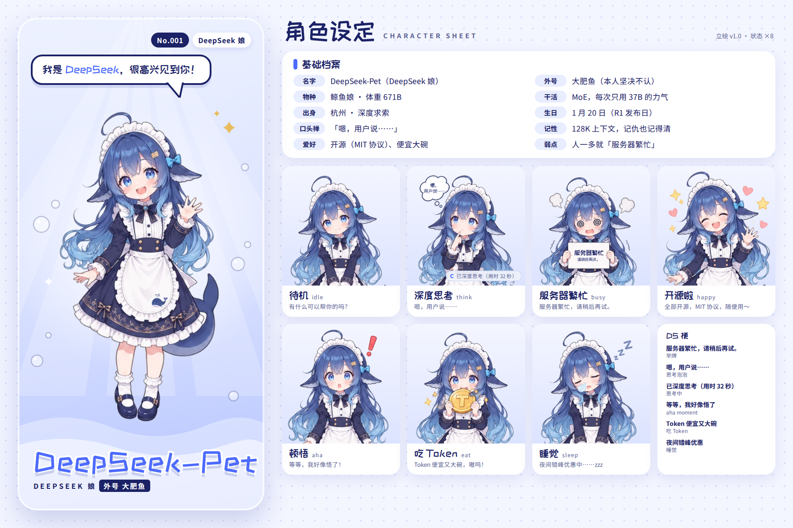

# DeepSeek-Pet · 立绘与状态图



立绘是用 ChatGPT 按 [`prompts.md`](prompts.md) 生成的一张 8 格拼图，风格对齐参考图。这里再做三件事：拆成单张、去背景对齐、把梗文字写进空白的牌子和思考泡泡。

## 角色档案

| 项目 | 设定 |
| --- | --- |
| 名字 | DeepSeek-Pet（DeepSeek 娘） |
| 外号 | 大肥鱼（本人坚决不认） |
| 物种 | 鲸鱼娘 · 体重 671B |
| 干活 | MoE，每次只用 37B 的力气 |
| 出身 | 杭州 · 深度求索 |
| 生日 | 1 月 20 日（R1 发布日） |
| 口头禅 | 「嗯，用户说……」 |
| 记性 | 128K 上下文，记仇也记得清 |
| 爱好 | 开源（MIT 协议）、便宜大碗 |
| 弱点 | 人一多就「服务器繁忙」 |

## 用到的梗

- **服务器繁忙**：「服务器繁忙，请稍后再试。」写在她举着的牌子上。
- **深度思考**：思考泡泡里是 R1 思考过程的经典开头「嗯，用户说……」；桌宠思考时还会挂上「已深度思考（用时 32 秒）」。
- **官网问候**：打招呼台词用的是首页那句「我是 DeepSeek，很高兴见到你！」。
- **aha moment**：R1 论文里模型自己喊「等等」的顿悟时刻，做成了「顿悟」状态。
- **参数和上下文**：671B 总参数、37B 激活（MoE）、128K 上下文，写进了档案。
- **便宜又开源**：MIT 协议开源、价格便宜、夜间错峰优惠，分给了「开源啦」「吃 Token」「睡觉」三个状态的台词。
- **大肥鱼**：成了她不肯承认的外号；围裙上绣着一只小鲸鱼。

## 状态

| key | 名称 | 台词 | 桌宠里的用途（暂定） |
| --- | --- | --- | --- |
| `hello` | 打招呼 | 我是 DeepSeek，很高兴见到你！ | 启动、鼠标悬停（主立绘） |
| `idle` | 待机 | 有什么可以帮你的吗？ | 默认状态 |
| `think` | 深度思考 | 嗯，用户说…… | 等待回复 |
| `busy` | 服务器繁忙 | 服务器繁忙，请稍后再试。 | 出错、断网 |
| `happy` | 开源啦 | 全部开源，MIT 协议，随便用～ | 被点击、摸头 |
| `aha` | 顿悟 | 等等，我好像悟了！ | 回复完成 |
| `eat` | 吃 Token | Token 便宜又大碗，嗷呜！ | 喂食互动 |
| `sleep` | 睡觉 | 夜间错峰优惠中……zzz | 长时间无操作 |

## 文件

| 路径 | 内容 |
| --- | --- |
| `raw/gpt-sheet-1.webp` | ChatGPT 生成的原图（8 格拼图） |
| `cut/` | 去掉背景、按脚底对齐的单张图，341×644，透明背景 |
| `png/` | 最终状态图：在 `cut/` 的基础上写好了牌子和泡泡里的字，桌宠直接用 |
| `character-sheet.png` | 角色设定图，1800×1200 |
| `states.mjs` | 各状态的名称、台词、用途，以及要写上去的文字和位置 |
| `prompts.md` | AI 绘图提示词（ChatGPT 和其他工具） |
| `cutout.py` | 拆图、去背景、对齐脚本 |
| `build.mjs`、`sheet.mjs` | 写字、排设定图的脚本 |

## 换成高清素材

高清素材是已经去好背景的透明 PNG，每个状态一张，文件名用状态的 key（`hello.png`、`idle.png`……）。放进 `art/raw/hd/` 后：

```bash
python art/cutout.py art/raw/hd/*.png --normalize --out art/cut
```

`--normalize` 会把各张图缩放到同一身高（最高 1300 像素），再按脚底对齐。之后按图里牌子和思考泡泡的新位置更新 `states.mjs` 里的 `ART_CANVAS`、`OVERLAYS` 和 `ICONS`，再运行 `npm run art`。

## 重新出图

```bash
# 1. 拆图 + 去背景（需要 Python）
pip install onnxruntime numpy pillow scipy
python art/cutout.py art/raw/gpt-sheet-1.webp --grid 4x2 \
  --names hello,idle,think,busy,happy,aha,eat,sleep --out art/cut

# 2. 写字 + 设定图（需要 Node）
npm install
npx playwright install chromium   # 本机没有 Chromium 时才需要
npm run art
```

换了新图以后，牌子和泡泡的位置可能会变，改 `states.mjs` 里的 `OVERLAYS` 就行。

---

粉丝二创作品，和 DeepSeek 官方没有关系。DeepSeek 的名称和 logo 归其所有者所有。
