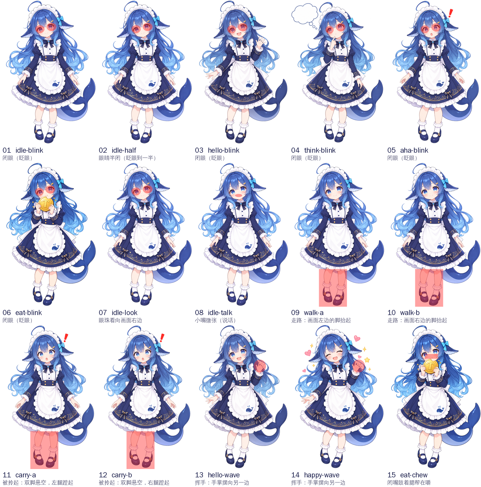

# 动作帧

让她像真人一样动：眨眼、说话、东张西望、走路、被拎起来时乱蹬腿、挥手、嚼东西。做法和动画片一样，每个动作多画几帧，程序按顺序切换，图片不拉伸、不变形。

ChatGPT 改图时会把整张图重画一遍，所以每一帧都**只改原图上很小的一块**：眼睛、嘴巴、举起的手，或者裙摆下面的腿。红色就是每一帧要改的地方：



## 规则

每一帧都是在一张原图上，只重画遮罩里的那一块：

- **原图**：`../raw/hd/` 里的图，1024×1536，透明背景。
- **遮罩**：`masks/<帧名>.png`，和原图一样大。透明的地方就是可以改的地方，其余部分必须和原图一模一样。
- **提示词**：`frames.json` 里每一帧的 `prompt`，英文，整段直接用。
- **结果**：存成 `out/<帧名>.png`，1024×1536，透明背景；做不到透明就用纯白背景，不要画棋盘格。

遮罩以外的东西一律不改：不移动、不缩放、不裁剪、不改姿势、不改画风。

## 15 帧

| # | 帧名 | 原图 | 遮罩 | 改哪里 | 改成什么 |
| --- | --- | --- | --- | --- | --- |
| 01 | `idle-blink` | [idle.png](../raw/hd/idle.png) | [遮罩](masks/idle-blink.png) | 两只眼睛 | 闭眼（眨眼） |
| 02 | `idle-half` | [idle.png](../raw/hd/idle.png) | [遮罩](masks/idle-half.png) | 两只眼睛 | 眼睛半闭（眨眼到一半） |
| 03 | `hello-blink` | [hello.png](../raw/hd/hello.png) | [遮罩](masks/hello-blink.png) | 两只眼睛 | 闭眼（眨眼） |
| 04 | `think-blink` | [think.png](../raw/hd/think.png) | [遮罩](masks/think-blink.png) | 两只眼睛 | 闭眼（眨眼） |
| 05 | `aha-blink` | [aha.png](../raw/hd/aha.png) | [遮罩](masks/aha-blink.png) | 两只眼睛 | 闭眼（眨眼） |
| 06 | `eat-blink` | [eat.png](../raw/hd/eat.png) | [遮罩](masks/eat-blink.png) | 两只眼睛 | 闭眼（眨眼） |
| 07 | `idle-look` | [idle.png](../raw/hd/idle.png) | [遮罩](masks/idle-look.png) | 两只眼睛 | 眼珠看向画面右边 |
| 08 | `idle-talk` | [idle.png](../raw/hd/idle.png) | [遮罩](masks/idle-talk.png) | 嘴巴 | 小嘴微张（说话） |
| 09 | `walk-a` | [idle.png](../raw/hd/idle.png) | [遮罩](masks/walk-a.png) | 裙摆下面的腿和鞋 | 走路：画面左边的脚抬起 |
| 10 | `walk-b` | [idle.png](../raw/hd/idle.png) | [遮罩](masks/walk-b.png) | 裙摆下面的腿和鞋 | 走路：画面右边的脚抬起 |
| 11 | `carry-a` | [aha.png](../raw/hd/aha.png) | [遮罩](masks/carry-a.png) | 裙摆下面的腿和鞋 | 被拎起：双脚悬空，左腿蹬起 |
| 12 | `carry-b` | [aha.png](../raw/hd/aha.png) | [遮罩](masks/carry-b.png) | 裙摆下面的腿和鞋 | 被拎起：双脚悬空，右腿蹬起 |
| 13 | `hello-wave` | [hello.png](../raw/hd/hello.png) | [遮罩](masks/hello-wave.png) | 举起的那只手 | 挥手：手掌摆向另一边 |
| 14 | `happy-wave` | [happy.png](../raw/hd/happy.png) | [遮罩](masks/happy-wave.png) | 举起的那只手 | 挥手：手掌摆向另一边 |
| 15 | `eat-chew` | [eat.png](../raw/hd/eat.png) | [遮罩](masks/eat-chew.png) | 嘴巴和两颊 | 闭嘴鼓着腮帮在嚼 |

最要紧的是 01–06（眨眼）和 09–12（走路、被拎起来）。

## 怎么生成

### 方法一：ChatGPT，一帧一帧来

1. 新开一个对话，只上传这一帧的原图。
2. 点开图片，用「选择」画笔涂抹 `guide.png` 里这一帧红色的那块。
3. 把 `frames.json` 里这一帧的 `prompt` 整段粘贴，发送。
4. 下载结果，改名为「帧名.png」，上传到这个文件夹的 `out/` 里。

### 方法二：脚本，一次画完

需要 OpenAI 的 API key，按量付费，15 张一般只要几美元：

```bash
OPENAI_API_KEY=sk-... node art/frames/generate.mjs
```

它会用原图、遮罩和提示词调用 OpenAI 的改图接口，结果直接存到 `out/`，已经画好的帧会跳过。某一帧不满意，可以指定帧名重画：

```bash
OPENAI_API_KEY=sk-... node art/frames/generate.mjs walk-a walk-b
```

想一次多出几张来挑，就加 `TRIES=3`，结果是 `out/walk-a-1.png`、`out/walk-a-2.png` 这样。挑一张改名成 `walk-a.png`。要换更新的图像模型，就设 `OPENAI_IMAGE_MODEL`。

## 改了原图或者区域以后

区域是在程序用的状态图上量的（`frames.json` 里的 `region`，单位是 908×1337 的像素），`masks.py` 会把它们换算到原图上，重新生成遮罩和 `guide.png`：

```bash
python art/frames/masks.py
```

## 画好以后

`out/` 里有图了，告诉我一声。我会把每张图改动的那一块对齐，贴回原图，保证别处纹丝不动，再把它们接进程序。
